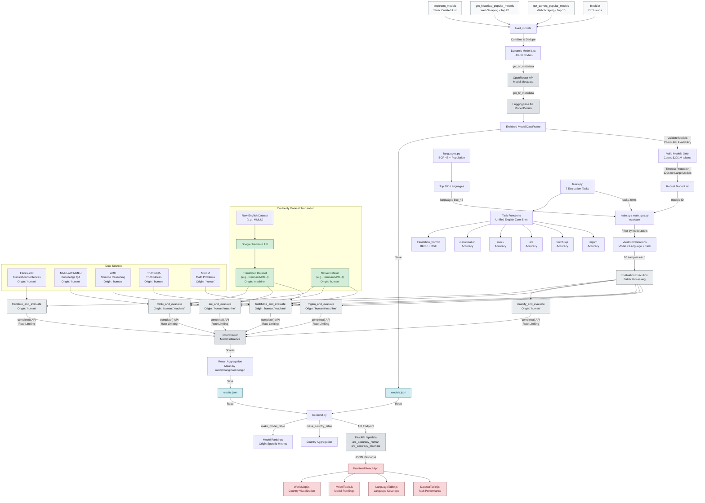

<!--
Check out the configuration reference at https://huggingface.co/docs/hub/spaces-config-reference 
For tag meaning, see https://huggingface.co/spaces/leaderboards/LeaderboardsExplorer
-->


[](https://huggingface.co/spaces/datenlabor-bmz/ai-language-monitor)

# AI Language Monitor 🌍

_Tracking language proficiency of AI models for every language_

## System Architecture

The AI Language Monitor evaluates language models across 100+ languages using a comprehensive pipeline that combines model discovery, automated evaluation, and real-time visualization.



**Key Features:**
- **Model Discovery**: Combines curated models with real-time trending models via web scraping
- **Multi-Task Evaluation**: 7 tasks across 100+ languages with origin tracking (human vs machine-translated)
- **Scalable Architecture**: Dual deployment (local/GitHub vs Google Cloud)
- **Real-time Visualization**: Interactive web interface with country-level insights

## Evaluate

### Local Development
```bash
uv run --extra dev evals/main.py
```

### Google Cloud Deployment
```bash
uv run --extra dev evals/main_gcs.py
```

## Explore

```bash
uv run evals/backend.py
cd frontend && npm i && npm start
```
