# languagebench - System Architecture

\[AI-generated, not 100% up-to-date\]

This diagram shows the complete data flow from model discovery through evaluation to frontend visualization.

```mermaid
flowchart TD
    %% Model Sources
    A1["important_models<br/>Static Curated List<br/>~34 models"] --> D[load_models]
    A4["blocklist<br/>Exclusions"] --> D
    
    %% Model Processing
    D --> |"Combine & Dedupe"| E["Dynamic Model List<br/>Validated Models"]
    E --> |get_or_metadata| F["OpenRouter API<br/>Model Metadata"]
    F --> |get_hf_metadata| G["HuggingFace API<br/>Model Details"]
    G --> H["Enriched Model DataFrame"]
    H --> |Save| I[models.json]
    
    %% Model Validation & Cost Filtering
    H --> |"Validate Models<br/>Check API Availability<br/>No User Data Training"| H1["Valid Models Only<br/>Cost ≤ $15/1M tokens"]
    H1 --> H2["Robust Model List<br/>Default: Top 40 models"]
    
    %% Language Data
    J["languages.py<br/>BCP-47 + Population<br/>Glottolog Families"] --> K["Languages Sorted by Speakers<br/>Default: Up to 1000 languages"]
    
    %% Task Registry with Unified Prompting
    L["tasks.py<br/>7 Evaluation Tasks"] --> M["Task Functions<br/>Unified English Zero-Shot<br/>Reasoning Template"]
    M --> M1["translation_from/to<br/>BLEU + ChrF"]
    M --> M2["classification<br/>Accuracy"]
    M --> M3["mmlu<br/>Accuracy"]
    M --> M4["arc<br/>Accuracy"] 
    M --> M5["truthfulqa<br/>Accuracy"]
    M --> M6["mgsm<br/>Accuracy"]
    
    %% On-the-fly Translation with Origin Tagging
    subgraph OTF [On-the-fly Dataset Translation]
        direction LR
        DS_raw["Raw English Dataset<br/>"] --> Google_Translate["Google Translate API"]
        Google_Translate --> DS_translated["Translated Dataset<br/>e.g., MGSM/ARC<br/>Origin: 'machine'"]
        DS_native["Native Dataset<br/>e.g., AfriMMLU/Global-MMLU<br/>Origin: 'human'"]
    end
    
    %% Evaluation Pipeline
    H2 --> |"models ID<br/>Default: 40 models"| N["main.py / main_gcs.py<br/>evaluate"]
    K --> |"languages bcp_47<br/>Default: 1000 languages"| N
    L --> |"tasks.items"| N
    N --> |"Filter by model.tasks<br/>Filter by valid task languages"| O["Valid Combinations<br/>Model × Language × Task"]
    O --> |"10 samples each"| P["Evaluation Execution<br/>Batch Processing<br/>Batch Size: 2000"]
    
    %% Task Execution with Origin Tracking
    P --> Q1[translate_and_evaluate<br/>Origin: 'human']
    P --> Q2[classify_and_evaluate<br/>Origin: 'human']
    P --> Q3[mmlu_and_evaluate<br/>Origin: 'human'<br/>no on-the-fly; uses auto-translated if available]
    P --> Q4[arc_and_evaluate<br/>Origin: 'human'/'machine']
    P --> Q5[truthfulqa_and_evaluate<br/>Origin: 'human'<br/>no on-the-fly; relies on available datasets]
    P --> Q6[mgsm_and_evaluate<br/>Origin: 'human'/'machine']
    
    %% API Calls with Error Handling
    Q1 --> |"complete() API<br/>Rate Limiting<br/>Reasoning: Low Effort"| R["OpenRouter<br/>Model Inference"]
    Q2 --> |"complete() API<br/>Rate Limiting<br/>Reasoning: Low Effort"| R
    Q3 --> |"complete() API<br/>Rate Limiting<br/>Reasoning: Low Effort"| R
    Q4 --> |"complete() API<br/>Rate Limiting<br/>Reasoning: Low Effort"| R
    Q5 --> |"complete() API<br/>Rate Limiting<br/>Reasoning: Low Effort"| R
    Q6 --> |"complete() API<br/>Rate Limiting<br/>Reasoning: Low Effort"| R
    
    %% Results Processing with Origin Aggregation
    R --> |Scores| S["Result Aggregation<br/>Mean by model+lang+task+origin<br/>Bootstrap Confidence Intervals"]
    S --> |Save| T["results.json<br/>results-detailed.json"]
    
    %% Backend & Frontend with Origin-Specific Metrics
    T --> |Read| U[backend.py]
    I --> |Read| U
    U --> |make_model_table| V["Model Rankings<br/>Origin-Specific Metrics<br/>Confidence Intervals"]
    U --> |make_country_table| W["Country Aggregation"]
    U --> |make_language_tier_history| V2["Language Tier History<br/>Top 1, 2-20, 20-200"]
    U --> |make_license_history| V3["License History<br/>Open-source vs Commercial"]
    U --> |"API Endpoint"| X["FastAPI /api/data<br/>arc_accuracy_human<br/>arc_accuracy_machine<br/>language_tier_history<br/>license_history"]
    X --> |"JSON Response"| Y["Frontend React App"]
    
    %% UI Components
    Y --> Z1["WorldMap.js<br/>Country Visualization"]
    Y --> Z2["ModelTable.js<br/>Model Rankings"]
    Y --> Z3["LanguageTable.js<br/>Language Coverage"]
    Y --> Z4["DatasetTable.js<br/>Task Performance"]
    Y --> Z5["LanguageTierHistoryPlot.js<br/>Tier-based Trends"]
    Y --> Z6["LicenseHistoryPlot.js<br/>License-based Trends"]
    
    %% Data Sources with Origin Information
    subgraph DS ["Data Sources"]
        DS1["FLORES+<br/>Translation Sentences<br/>Origin: 'human'"]
        DS2["MMLU Variants<br/>AfriMMLU/Global-MMLU/MMMLU<br/>HF Auto-translated MMLU<br/>Origin: 'human' or 'machine'"]
        DS3["Uhuru ARC Easy<br/>Auto-translated ARC<br/>Origin: 'human' or 'machine'"]
        DS4["Uhura TruthfulQA<br/>Auto-translated TruthfulQA<br/>Origin: 'human' or 'machine'"]
        DS5["MGSM Variants<br/>MGSM/AfriMGSM/GSM8K-X<br/>Auto-translated GSM<br/>Origin: 'human' or 'machine'"]
    end
    
    DS1 --> Q1
    DS2 --> Q3
    DS3 --> Q4
    DS4 --> Q5
    DS5 --> Q6
    
     %% No on-the-fly DS_translated for MMLU anymore; only HF auto-translated used
    DS_translated --> Q4
    DS_translated --> Q5
    
    DS_native --> Q3
    DS_native --> Q4
    DS_native --> Q5
    
    %% Styling - Neutral colors that work in both dark and light modes
    classDef modelSource fill:#f8f9fa,stroke:#6c757d,color:#212529
    classDef evaluation fill:#e9ecef,stroke:#495057,color:#212529
    classDef api fill:#dee2e6,stroke:#6c757d,color:#212529
    classDef storage fill:#d1ecf1,stroke:#0c5460,color:#0c5460
    classDef frontend fill:#f8d7da,stroke:#721c24,color:#721c24
    classDef translation fill:#d4edda,stroke:#155724,color:#155724
    
    class A1,A4 modelSource
    class Q1,Q2,Q3,Q4,Q5,Q6,P evaluation
    class R,F,G,X api
    class T,I storage
    class Y,Z1,Z2,Z3,Z4,Z5,Z6 frontend
    class Google_Translate,DS_translated,DS_native translation
```

## Architecture Components

### 🔵 Model Discovery (Light Gray)
- **Static Curated Models**: Handpicked important models (~34 models) for comprehensive evaluation
- **Dynamic Popular Models**: Web scraping capability available but currently disabled
- **Quality Control**: Blocklist for problematic or incompatible models
- **Model Validation**: API availability checks, cost filtering (≤$15/1M tokens), and exclusion of providers that train on user data
- **Default Selection**: Top 40 models by default (configurable via N_MODELS)
- **Metadata Enrichment**: Rich model information from OpenRouter and HuggingFace APIs

### 🟣 Evaluation Pipeline (Medium Gray)
- **7 Active Tasks**: Translation (bidirectional), Classification, MMLU, ARC, TruthfulQA, MGSM
- **Unified English Zero-Shot Prompting**: All tasks use English instructions with target language content
- **Reasoning Template**: Tasks use structured reasoning format with `<reasoning>...</reasoning><final_answer>...</final_answer>` tags
- **Origin Tagging**: Distinguishes between human-translated ('human') and machine-translated ('machine') data
- **Combinatorial Approach**: Systematic evaluation across Model × Language × Task combinations
- **Sample-based**: 10 evaluations per combination for statistical reliability (configurable via N_SENTENCES)
- **Batch Processing**: 2000 tasks per batch with rate limiting and error resilience
- **Language Filtering**: Pre-computed valid languages per task to filter invalid combinations
- **Default Scale**: 40 models × 1000 languages × 7 tasks × 10 samples (configurable via environment variables)
- **Dual Deployment**: `main.py` for local/GitHub, `main_gcs.py` for Google Cloud with GCS storage

### 🟠 API Integration (Light Gray)
- **OpenRouter**: Primary model inference API for all language model tasks
- **Rate Limiting**: Async rate limiters (20 req/s OpenRouter, 10 req/s Google Translate, 5 req/s HuggingFace)
- **Reasoning Configuration**: Low-effort reasoning mode enabled for efficiency
- **Error Handling**: Graceful handling of timeouts, rate limits, filtered content, and model unavailability
- **HuggingFace**: Model metadata and open-source model information via HfApi
- **Google Translate**: Specialized translation API for on-the-fly dataset translation (when needed)

### 🟢 Data Storage (Cyan)
- **results.json**: Aggregated evaluation scores with origin-specific metrics
- **results-detailed.json**: Detailed results with individual sample scores for bootstrap CI calculation
- **models.json**: Dynamic model list with metadata and validation status
- **languages.json**: Language information with population data, Glottolog families, and script information
- **Immutable Log**: Results are cached and merged to avoid re-computation

### 🟡 Frontend Visualization (Light Red)
- **WorldMap**: Interactive country-level visualization with language selection
- **ModelTable**: Ranked model performance leaderboard with origin-specific columns and confidence intervals
- **LanguageTable**: Language coverage and speaker statistics with confidence intervals
- **DatasetTable**: Task-specific performance breakdowns with human/machine distinction
- **LanguageTierHistoryPlot**: Historical trends for language tiers (Top 1, Top 2-20, Top 20-200)
- **LicenseHistoryPlot**: Historical trends comparing open-source vs commercial models
- **Confidence Intervals**: Bootstrap-based 95% confidence intervals for all metrics

### 🔵 Translation & Origin Tracking (Light Green)
- **Dataset-Based Translation**: Uses HuggingFace auto-translated datasets (MMLU, ARC, TruthfulQA, MGSM) when available
- **On-the-fly Translation**: Google Translate API available but primarily used for translation tasks
- **Origin Tagging**: Automatic classification of data sources (human vs. machine translated)
- **Separate Metrics**: Frontend displays distinct scores for human and machine-translated data
- **Dataset Variants**: Supports multiple dataset variants (e.g., AfriMMLU, Global-MMLU, MMMLU for MMLU)

## Data Flow Summary

1. **Model Discovery**: Load curated models (~34) → validate API availability and cost (≤$15/1M tokens) → exclude providers training on user data → enrich with metadata from OpenRouter and HuggingFace
2. **Evaluation Setup**: Generate all valid Model × Language × Task combinations (default: 40 models × 1000 languages) with pre-computed language filtering and origin tracking
3. **Task Execution**: Run evaluations using unified English prompting with reasoning templates, batch processing (2000 per batch), and rate limiting
4. **Result Processing**: Aggregate scores by model+language+task+origin, compute bootstrap confidence intervals, and save to JSON files (results.json and results-detailed.json)
5. **Backend Serving**: FastAPI serves processed data with origin-specific metrics, confidence intervals, language tier history, and license history via REST API
6. **Frontend Display**: React app visualizes data through interactive components (WorldMap, ModelTable, LanguageTable, DatasetTable, LanguageTierHistoryPlot, LicenseHistoryPlot) with transparency indicators and confidence intervals

This architecture enables scalable, automated evaluation of AI language models across diverse languages and tasks while providing real-time insights through an intuitive web interface with methodological transparency and statistical rigor. 