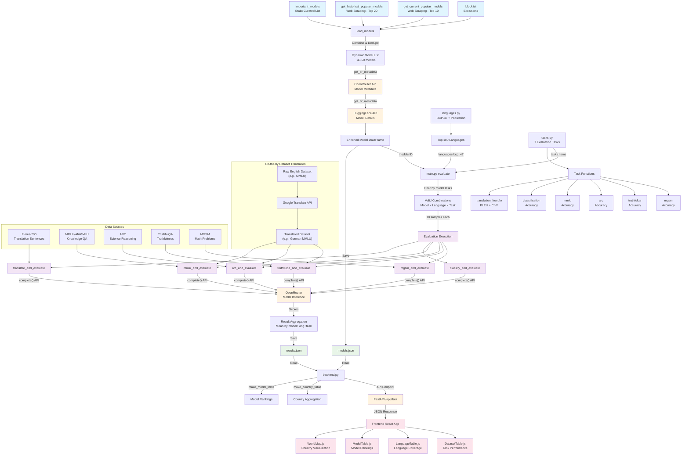

# AI Language Monitor - System Architecture

This diagram shows the complete data flow from model discovery through evaluation to frontend visualization.

## Architecture Components

### 🔵 Model Discovery (Blue)
- **Static Curated Models**: Handpicked important models for comprehensive evaluation
- **Dynamic Popular Models**: Real-time discovery of trending models via web scraping
- **Quality Control**: Blocklist for problematic or incompatible models
- **Metadata Enrichment**: Rich model information from OpenRouter and HuggingFace APIs

### 🟣 Evaluation Pipeline (Purple)
- **7 Active Tasks**: Translation (bidirectional), Classification, MMLU, ARC, TruthfulQA, MGSM
- **Combinatorial Approach**: Systematic evaluation across Model × Language × Task combinations
- **Sample-based**: 10 evaluations per combination for statistical reliability
- **Unified API**: All tasks use OpenRouter's `complete()` function for consistency

### 🟠 API Integration (Orange)
- **OpenRouter**: Primary model inference API for all language model tasks
- **HuggingFace**: Model metadata and open-source model information
- **Google Translate**: Specialized translation API for comparison baseline

### 🟢 Data Storage (Green)
- **results.json**: Aggregated evaluation scores and metrics
- **models.json**: Dynamic model list with metadata
- **languages.json**: Language information with population data

### 🟡 Frontend Visualization (Pink)
- **WorldMap**: Interactive country-level language proficiency visualization
- **ModelTable**: Ranked model performance leaderboard
- **LanguageTable**: Language coverage and speaker statistics
- **DatasetTable**: Task-specific performance breakdowns

## Data Flow Summary

1. **Model Discovery**: Combine curated + trending models → enrich with metadata
2. **Evaluation Setup**: Generate all valid Model × Language × Task combinations
3. **Task Execution**: Run evaluations using appropriate datasets and APIs
4. **Result Processing**: Aggregate scores and save to JSON files
5. **Backend Serving**: FastAPI serves processed data via REST API
6. **Frontend Display**: React app visualizes data through interactive components

This architecture enables scalable, automated evaluation of AI language models across diverse languages and tasks while providing real-time insights through an intuitive web interface. 